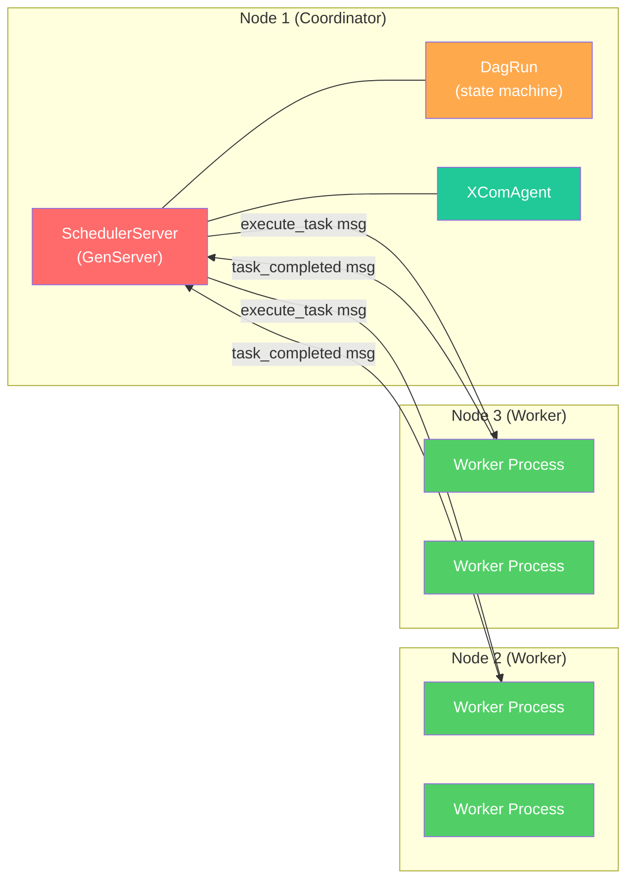

# Distributed Execution

ironpipe supports distributing DAG task execution across multiple machines using Rebar's clustering layer. The architecture is coordinator/worker: one node runs the scheduler, other nodes run worker processes that execute tasks.

## Architecture



## How It Works

Rebar's `DistributedRouter` makes this transparent. Every `ProcessId` carries a `node_id`. When you call `ctx.send(pid, payload)`:

- If `pid.node_id() == self.node_id` — local delivery via the process table
- If `pid.node_id() != self.node_id` — encodes as a `Frame` and sends over the network via `ConnectionManager`

The scheduler doesn't need to know whether a worker is local or remote. It just sends messages to `ProcessId`s.

## Message Protocol

### Coordinator to Worker

```json
{
    "type": "execute_task",
    "task_id": "extract_data",
    "run_id": "run_001",
    "attempt": 1
}
```

### Worker to Coordinator

```json
{
    "type": "task_completed",
    "task_id": "extract_data",
    "success": true,
    "xcom": {"row_count": 1000},
    "worker_node": 2
}
```

## Components

### Worker

A long-lived process on a worker node that receives execution requests and dispatches them to local `TaskExecutor` implementations.

```rust
use ironpipe::*;
use std::collections::HashMap;
use std::sync::Arc;

let runtime = Arc::new(rebar::runtime::Runtime::new(2)); // node 2

let mut executors: HashMap<TaskId, Arc<dyn TaskExecutor>> = HashMap::new();
executors.insert(TaskId::new("extract"), Arc::new(MyExtractor));
executors.insert(TaskId::new("transform"), Arc::new(MyTransformer));

let worker = Worker::spawn(runtime, executors).await;
// worker.pid() can be sent to the coordinator
```

### WorkerPool

Round-robin dispatch across multiple workers, potentially on different nodes.

```rust
use ironpipe::WorkerPool;
use rebar::process::ProcessId;

let mut pool = WorkerPool::new(vec![
    ProcessId::new(2, 1),  // worker on node 2
    ProcessId::new(2, 2),  // another on node 2
    ProcessId::new(3, 1),  // worker on node 3
]);

let next = pool.next_worker().unwrap(); // round-robin
```

### build_execute_message

Builds the JSON message payload for dispatching a task to a worker.

```rust
use ironpipe::{build_execute_message, TaskId};

let msg = build_execute_message(&TaskId::new("extract"), "run_001", 1);
// Send via ctx.send(worker_pid, msg)
```

## Scaling Pattern

```
                    ┌─────────────────────┐
                    │    Coordinator       │
                    │  (Node 1)            │
                    │                      │
                    │  SchedulerServer     │
                    │  DagRun state        │
                    │  XComAgent           │
                    └──────┬──────┬────────┘
                           │      │
              ┌────────────┘      └────────────┐
              │                                │
    ┌─────────▼──────────┐          ┌──────────▼─────────┐
    │   Worker Node 2    │          │   Worker Node 3    │
    │                    │          │                    │
    │  Worker(extract)   │          │  Worker(transform) │
    │  Worker(load)      │          │  Worker(validate)  │
    └────────────────────┘          └────────────────────┘
```

1. **Coordinator** spawns the `SchedulerServer` and `DagRun`
2. **Workers** register their executors and spawn Worker processes
3. Worker PIDs are collected into a `WorkerPool`
4. The scheduler dispatches tasks to workers by PID — Rebar routes to the correct node
5. Workers execute and send `task_completed` messages back — Rebar routes home
6. The scheduler updates state, ticks, dispatches the next batch

## Requirements

Each worker node must:
- Run a Rebar `DistributedRuntime` with a unique `node_id`
- Have the `TaskExecutor` implementations compiled in (executors are not serialized over the wire — only task IDs and results are)
- Be connected to the coordinator via Rebar's `ConnectionManager` (QUIC transport)

## Limitations

- **Executors must be present on workers** — the coordinator sends a task ID, not code. Each worker needs the relevant `TaskExecutor` implementations registered locally.
- **XCom stays on the coordinator** — values are extracted from the completion message and pushed to the coordinator's `XComAgent`. Workers don't have direct XCom access during execution (they use `TaskContext` locally, results are forwarded).
- **No automatic worker discovery** — workers must be registered with the coordinator. Rebar's SWIM gossip protocol can help automate this in future.
