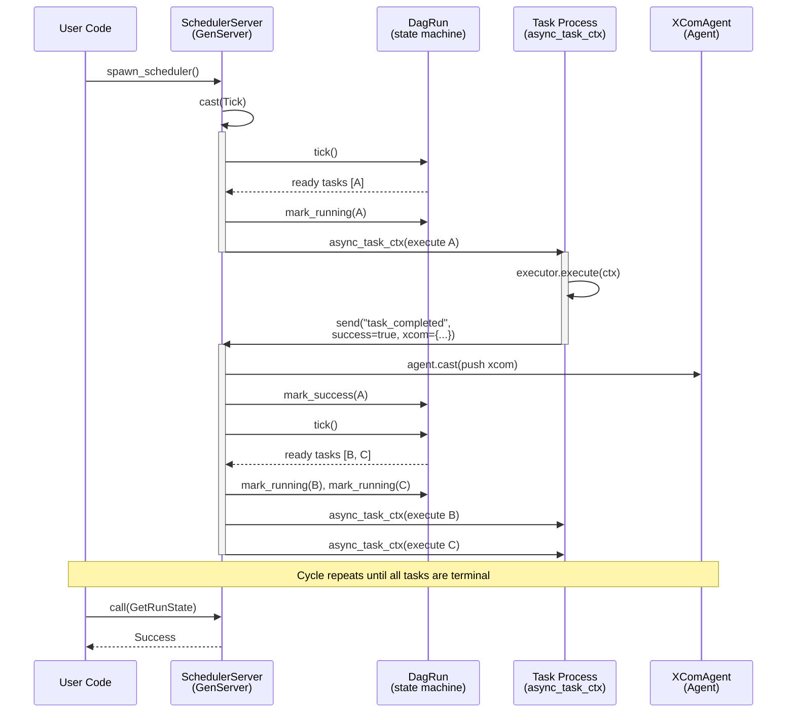

# Rebar Integration

## Message Flow



## Actor Mapping

| Concept | Rebar Primitive | Module |
|----------------|-----------------|--------|
| Scheduler | `SchedulerServer` (GenServer) | `scheduler_actor.rs` |
| Task Instance execution | `async_task_ctx` (Task process with context) | `scheduler_actor.rs` |
| XCom backend | `XComAgent` (Agent) | `xcom_actor.rs` |
| DAG Run state | `DagRun` (owned by SchedulerServer) | `dag_run.rs` |
| Operator / Task logic | `TaskExecutor` trait impl | `executor.rs` |
| DAG Run handle | `DagHandle` (wraps `GenServerRef`) | `scheduler_actor.rs` |

### Why These Primitives

- **GenServer for the scheduler** -- The scheduler needs typed call/cast/info channels, state ownership, and prioritized message handling (calls have timeouts). GenServer provides all of this.
- **Agent for XCom** -- XCom is pure shared state with get/update/cast operations. Agent eliminates the boilerplate of custom Call/Cast/Reply enums that a GenServer would require.
- **async_task_ctx for task execution** -- Each task runs as a Rebar process with a `ProcessContext` for messaging back to the scheduler. `async_task_ctx` provides proper `Task<T>` handles with result tracking and timeout support.

## How XCom Flows Through the Agent

XCom (cross-communication) allows tasks to pass data to downstream tasks. The flow involves three stages:

### 1. Task Produces XCom

During execution, a task pushes values into its local `TaskContext`:

```rust
ctx.xcom_push("return_value", json!({"row_count": 1000}));
```

This writes to a local `XComStore` inside the `TaskContext`. The data does not leave the task process yet.

### 2. Completion Message Carries XCom

When the task process finishes, it serializes all XCom values into the `task_completed` message sent back to the scheduler:

```json
{
    "type": "task_completed",
    "task_id": "extract",
    "success": true,
    "xcom": {
        "return_value": {"row_count": 1000}
    }
}
```

### 3. Scheduler Pushes to XCom Agent

In `handle_info`, the scheduler extracts the xcom map and pushes to the Agent via fire-and-forget cast:

```rust
state.xcom.push(task_id.clone(), key, value);
```

The Agent serializes concurrent pushes internally -- no locks or custom message types needed.

### Reading XCom

Any code with an `XComAgent` handle can read values:

```rust
let val = xcom.pull(
    TaskId::new("extract"),
    "return_value".to_string(),
    Duration::from_secs(1),
).await;
```

## Supervision and Fault Tolerance

Rebar provides process-level isolation. Each task runs in its own spawned process via `async_task_ctx`:

- **Isolation** -- A panic or error in one task process does not crash the scheduler or other tasks.
- **Completion signaling** -- Every task process sends a `task_completed` message back to the scheduler, reporting success or failure.
- **Retry handling** -- When a task fails and has remaining retries, the scheduler transitions it to `UpForRetry`. On the next tick, it appears in the ready list and is dispatched as a new process.
- **Scheduler resilience** -- The `SchedulerServer` itself is a GenServer. If placed under a Rebar supervisor, it could be restarted on crash.

## Using spawn_scheduler

`spawn_scheduler` is the main entry point. It wires up the DAG, executors, runtime, and actors:

```rust
use ironpipe::*;
use std::collections::HashMap;
use std::sync::Arc;
use std::time::Duration;

struct ExtractExecutor;

#[async_trait::async_trait]
impl TaskExecutor for ExtractExecutor {
    async fn execute(
        &self,
        ctx: &mut TaskContext,
    ) -> Result<(), Box<dyn std::error::Error + Send + Sync>> {
        ctx.xcom_push("rows", serde_json::json!(500));
        Ok(())
    }
}

struct LoadExecutor;

#[async_trait::async_trait]
impl TaskExecutor for LoadExecutor {
    async fn execute(
        &self,
        ctx: &mut TaskContext,
    ) -> Result<(), Box<dyn std::error::Error + Send + Sync>> {
        Ok(())
    }
}

async fn run_pipeline() {
    let mut dag = Dag::new("my_pipeline");
    dag.add_task(Task::builder("extract").retries(2).build()).unwrap();
    dag.add_task(Task::builder("load").build()).unwrap();
    dag.set_downstream(&TaskId::new("extract"), &TaskId::new("load")).unwrap();

    let mut executors: HashMap<TaskId, Arc<dyn TaskExecutor>> = HashMap::new();
    executors.insert(TaskId::new("extract"), Arc::new(ExtractExecutor));
    executors.insert(TaskId::new("load"), Arc::new(LoadExecutor));

    let runtime = Arc::new(rebar::runtime::Runtime::new(4));
    let handle = spawn_scheduler(
        runtime, dag, executors, "run_001", chrono::Utc::now(),
    ).await;

    let final_state = handle
        .wait_for_completion(Duration::from_millis(50), Duration::from_secs(60))
        .await
        .unwrap();

    println!("Pipeline finished: {final_state:?}");
}
```

### DagHandle API

| Method | Return Type | Description |
|--------|------------|-------------|
| `run_state()` | `DagRunState` | Current overall run state |
| `task_state(id)` | `TaskState` | State of a specific task |
| `all_task_states()` | `HashMap<TaskId, TaskState>` | Snapshot of all task states |
| `is_complete()` | `bool` | Whether the run has finished |
| `wait_for_completion(poll, timeout)` | `DagRunState` | Block until done or timeout |

All methods communicate with the `SchedulerServer` via GenServer `call` messages, so they are safe to use from any async context.
